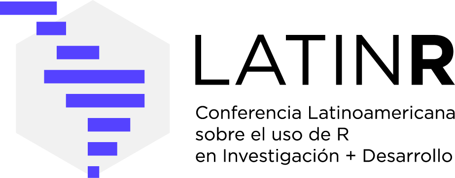

# Introducción {.unnumbered}

{fig-align="center" width=40%}

## Sobre LatinR 2022

LatinR es la Conferencia Latinoamericana sobre Uso de R en Investigación + Desarrollo. 
En su edición 2022, la conferencia se realizó de forma virtual del 12 al 14 de octubre de 2022.

LatinR reúne a personas que usan R para investigación, ciencia de datos, análisis estadístico, 
desarrollo de paquetes y enseñanza en América Latina y el mundo.

## Sobre estas actas

Este libro reúne los resúmenes y trabajos presentados en LatinR 2022. Incluye contribuciones
de autoría latinoamericana e internacional sobre temas como:

- Desarrollo de paquetes de R
- Aplicaciones web con Shiny
- Uso de datos públicos y estadísticas oficiales
- Ciencias sociales, artes y humanidades
- Enseñanza y comunidades
- Modelos y aplicaciones estadísticas

## Datos de la publicación

| | |
|---|---|
| **ISSN** | 2618-3196 |
| **Editoras** | Yanina Bellini Saibene, Riva Quiroga, Natalia Da Silva |
| **Publicación** | Octubre 2022 |
| **Formato** | Libro digital (PDF) |
| **Repositorio** | <https://github.com/LatinR/presentaciones-LatinR2022> |

## Cita sugerida

Bellini Saibene, Y., Quiroga, R. y Da Silva, N. (Eds.) (2022). *Libro de Actas LatinR 2022 — 
V Conferencia Latinoamericana sobre Uso de R en Investigación + Desarrollo*. 
ISNN 2618-3196. Conferencia virtual, octubre 2022. 
<https://github.com/LatinR/presentaciones-LatinR2022>

## Licencia

Los trabajos incluidos en estas actas son propiedad intelectual de sus respectivos autores y 
autoras. El material se reproduce con fines de archivo y difusión científica.
